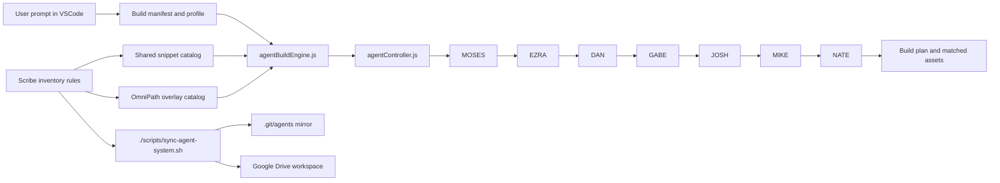

# OmniPath Agent System Map

This document explains how the OmniPath build system fits together.

## Mermaid

## Notes

- `agentBuildEngine.js` reads the build manifest, matches template and catalog items, and hands the request to `agentController.js`.
- `agentController.js` runs the agent chain in order: `MOSES -> EZRA -> DAN -> GABE -> JOSH -> MIKE -> NATE`.
- Shared reusable assets live in `snippet_catalog/ui-snippets.json`.
- OmniPath-only reusable assets live in `snippet_catalog/omnipath-snippets.json`.
- `Scribe` owns inventory, numbering, and documentation consistency.
- `./scripts/sync-agent-system.sh` pushes the root package to `.git/agents` and the Google Drive workspace copy.
